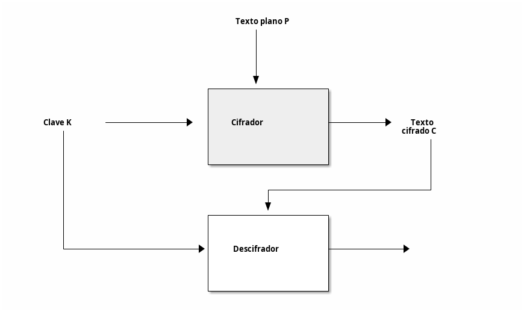

Cifrado
=================

Fundamentos
----------------

Algunos términos básicos:

* *Texto plano o "plaintext":* texto sin cifrar.
* *Texto cifrado o "ciphertext":* texto despues de aplicar el cifrado.

Los procesos de cifrar y descifrar se representan por:

* E(K,M)=C, donde E= *encrypt*, K= *key* y M= *message.*
* D(K,C)=M, donde D= *decrypt* y C= *ciphertext.*

   Cifrado y descifrado

Cifrados clásicos
---------------------

Cifrado de César
~~~~~~~~~~~~~~~~~

.. index::
   cifrado César

Dado un texto se sustituye cada letra por la letra que haya 3 posiciones despues en el alfabeto. Así, el texto *ZOO* se reemplaza por *CRR*

Cifrado de Vigènere
~~~~~~~~~~~~~~~~~~~~~~~

.. index:: 
   cifrado Vigènere

Utiliza una clave textual que representa una secuencia numérica. Por ejemplo, la clave DUH representa las posiciones 3,20 y 7. Tomamos una palabra como *CRYPTO* y la C la desplazamos 3 veces, la R 20 veces, la Y 7, la P 3 veces y así sucesivamente. El cifrado de *CRYPTO* quedaría *FLFSNV* 

Como funcionan los cifrados
--------------------------------

.. index::
   permutación
   sustitución

Podemos asumir que un cifrado se basa en dos elementos: 

1. Una **permutación**: básicamente es un procedimiento que reemplaza un elemento (y solo uno) por otro elemento (y solo por otro elemento).
2. Y un **modo de operación**: es el algoritmo para transformar mensajes de un tamaño arbitrario usando la permutación.

La permutación
~~~~~~~~~~~~~~~~~~~~~~~
Los cifrados clásicos reemplazan una letra por otra, es decir hacen una *sustitución.* Sin embargo no vale cualquier sustitución. Si en un cifrado tipo César reemplazásemos **Z** por **C** y la **X** también por **C** entonces sería imposible hacer el descifrado. Lo que se hace es en realidad **una permutación.** Para que haya seguridad, la permutación debe cumplir algunos criterios:

1. La permutación debería depender de la clave.
2. Diferentes claves deberían dar lugar a diferentes permutaciones.
3. La permutación debería tener aspecto aleatorio. Si pudieran apreciarse patrones sería posible descifrar el texto cifrado.

Una permutación que cumpla estos 3 criterios se denomina una *permutación segura.* 

El modo de operacion
~~~~~~~~~~~~~~~~~~~~~~~~~~~~~~~~~~~~~~~~~~~~~~~~

